# 🏠 Smart Home App  

A modern **Flutter smart home control app** for managing connected devices.  
Built with **Clean Architecture** and powered by **BLoC state management and API**.  

---

## 📖 About  

I developed a fully functional **Smart Home application** that provides users with an intuitive and secure way to control, monitor, and automate their home devices.  
The app allows users to connect to nearby hubs, manage rooms, control devices, and monitor energy usage — all from one place.  

---

## 🚀 Features  

### 🔐 Authentication  
- Sign-in / Sign-up  
- Logout  

### 🏡 Device & Room Management  
- Create and manage rooms (e.g., Living Room, Bedroom, Kitchen)  
- Add / remove / rename smart devices  
- View connected device details (status, signal, type)  

### 💡 Smart Device Control  
- Turn on/off lights, fans, and appliances  
- Adjust brightness, color, and temperature  
- Real-time device status updates  

### 🧠 Smart Experience  
- Push notifications for device alerts and automation updates  
- Smooth UI transitions and responsive layout  

### ⚡ Performance  
- Optimized state management with Cubit  
- Local caching for faster loading and offline access  

---

## 📱 Preview  

### Cover App Preview  
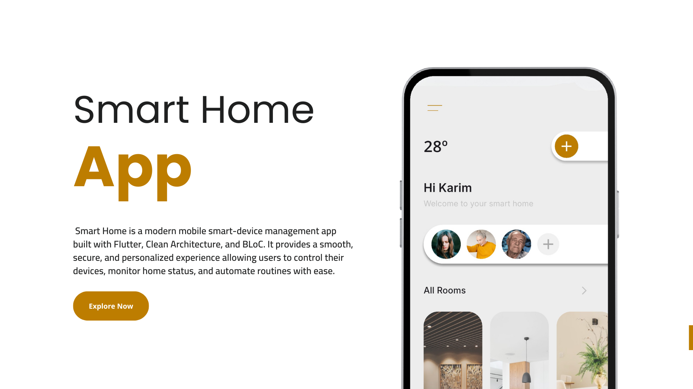  

### Welcome To Smart Home App  
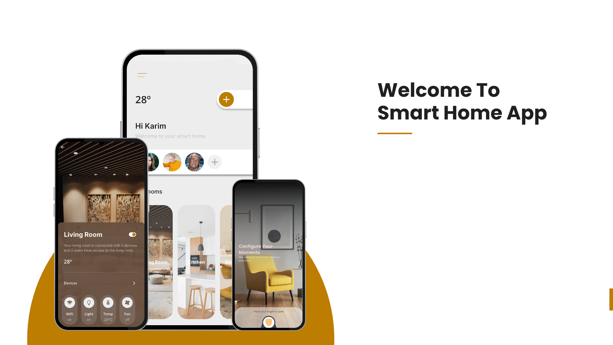  

### Splash Screen  
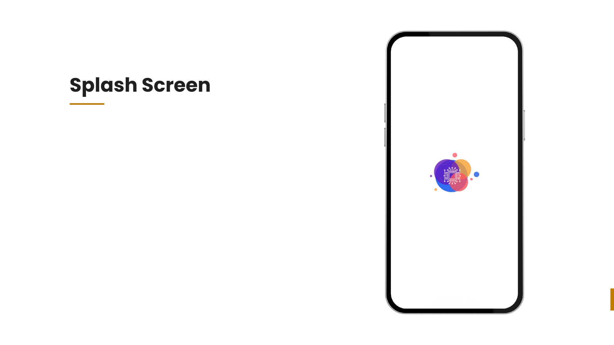  

### Onboarding Screens 
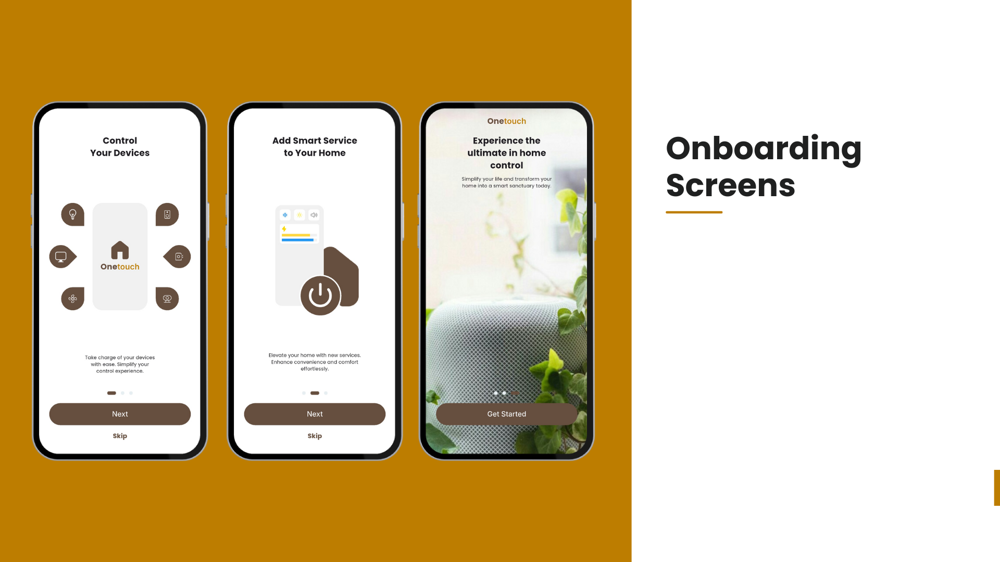  

### Finger Auth Screen  
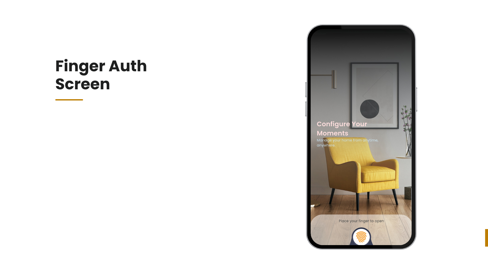  

### Auth Screens  
  

### Project Screens  
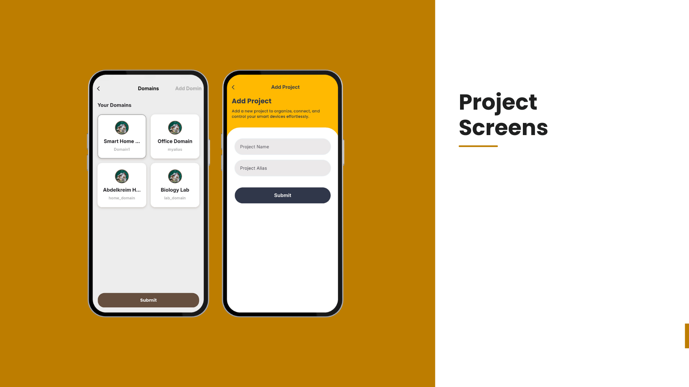  

### Home Screen  
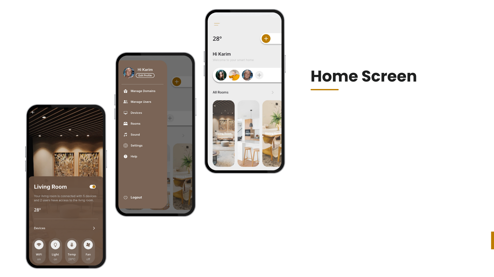  

### Settings Screens  
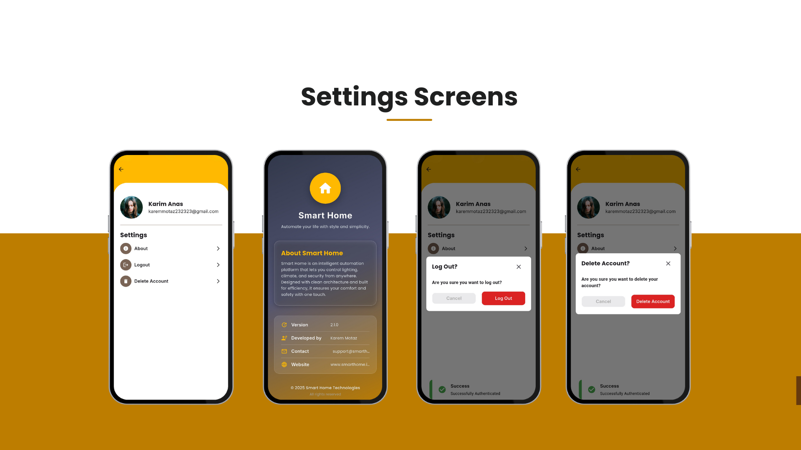  

### Profile Screen 
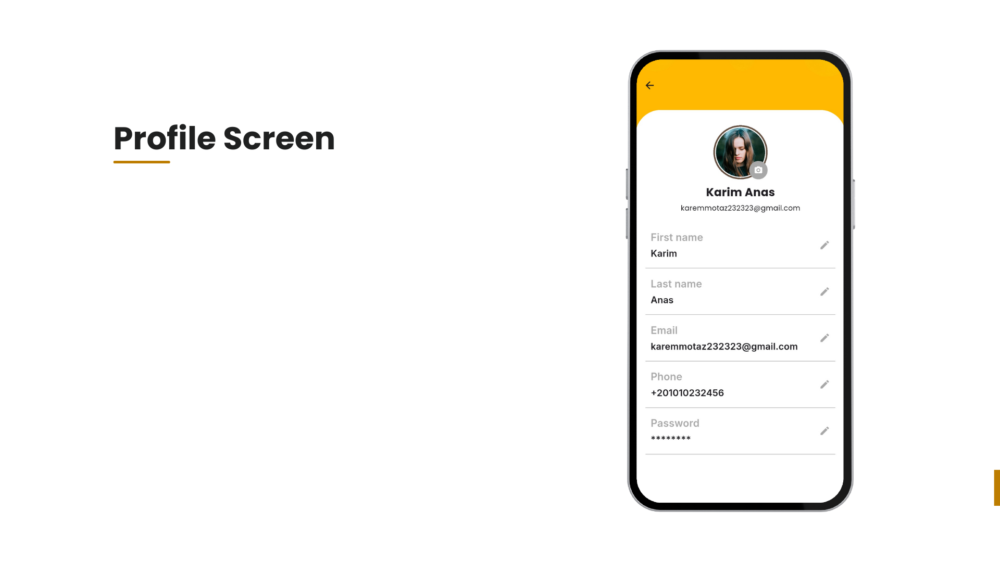  

### Edit Profile  Screens  
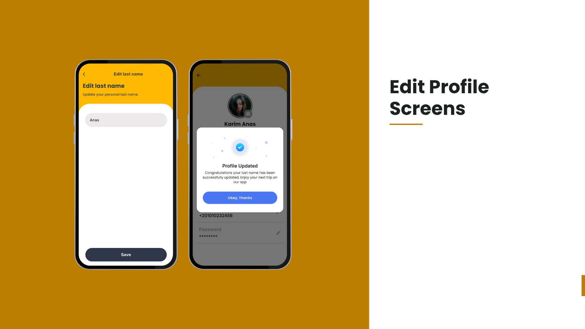  

### Contact Us  
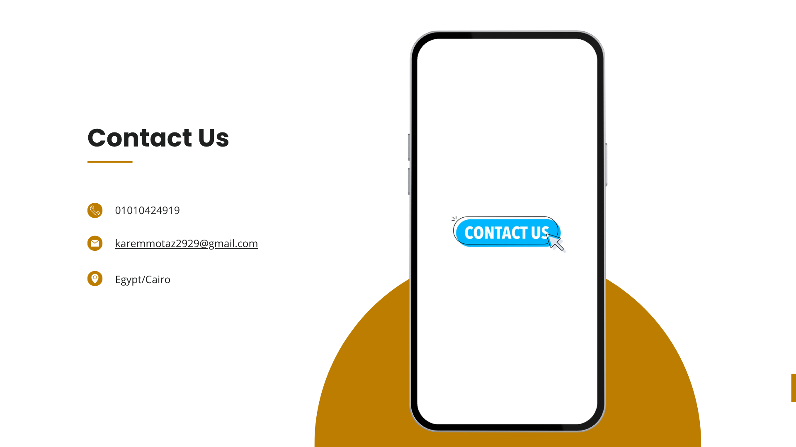  

### Thank You  
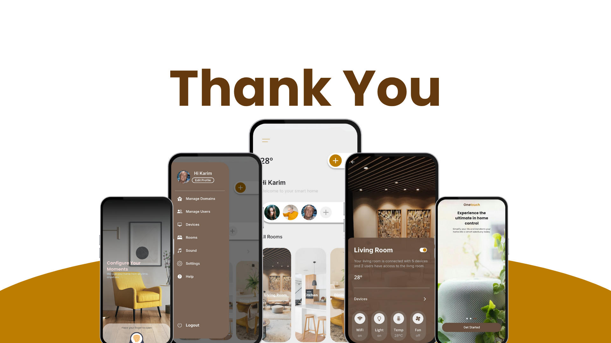  

---

## 🛠️ Tech Stack  
- **Flutter** (Clean Architecture + BLoC/Cubit)  
- **REST API** for device management  
- **Hive / SharedPreferences** for local caching  

---

## 📩 Contact  

If you’d like to collaborate or learn more:  
📧 Email: [karemmotaz2929@gmail.com]  
🌐 LinkedIn: [https://www.linkedin.com/in/karem-motaz-bb55a9213/]  

---
